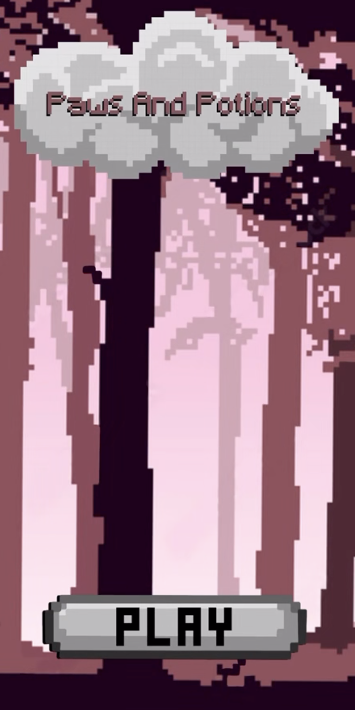
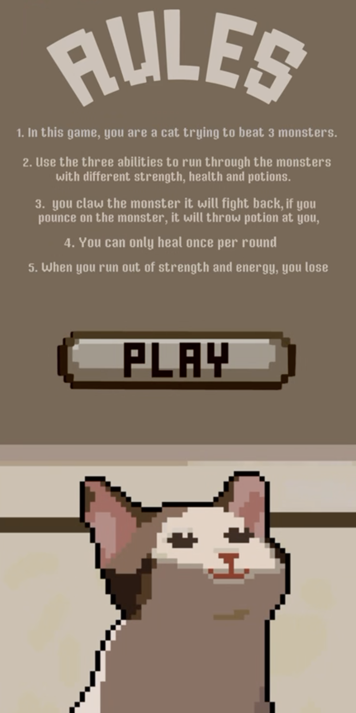
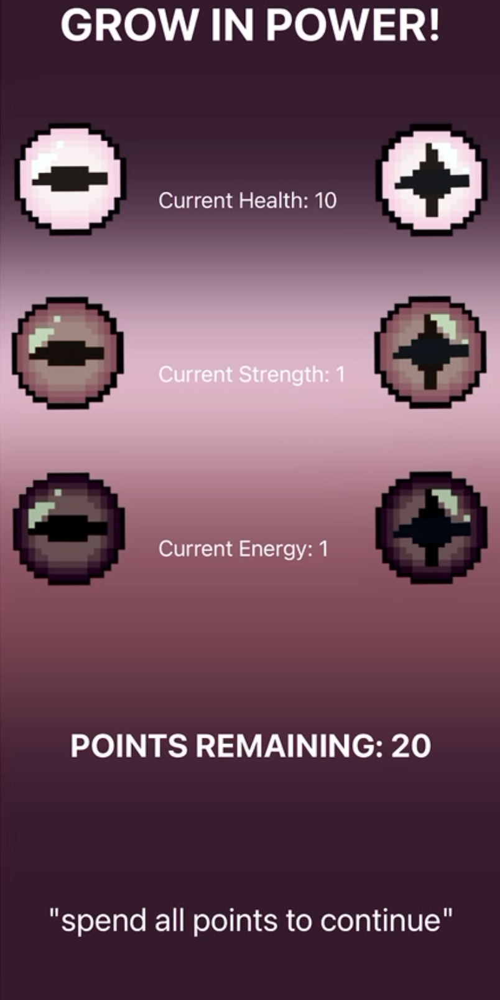
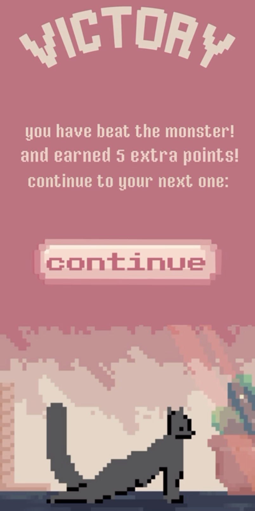
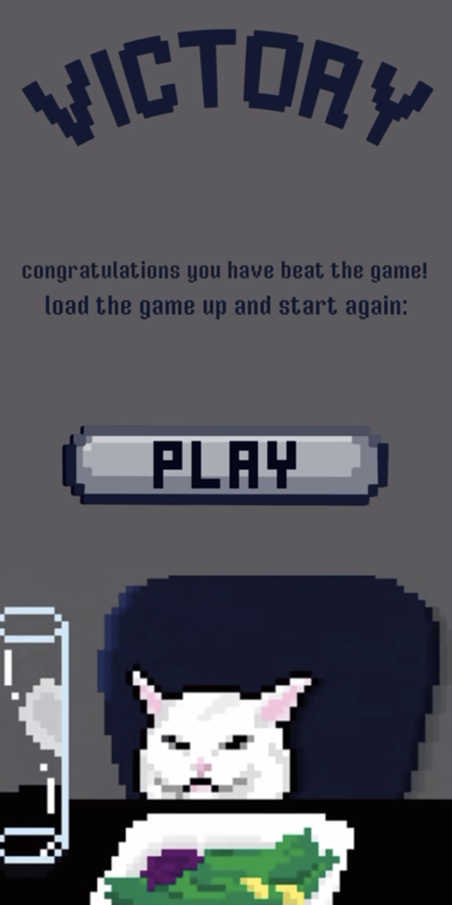
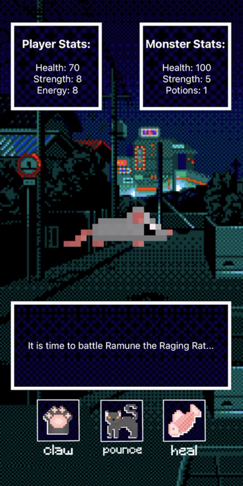
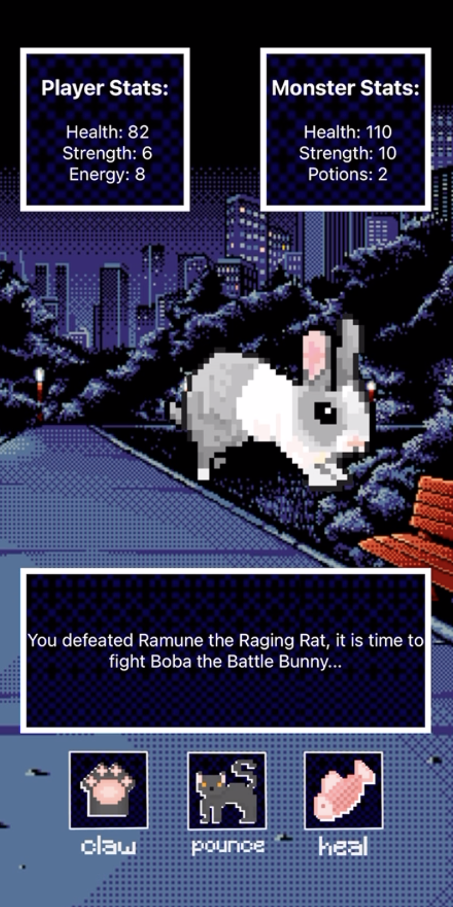
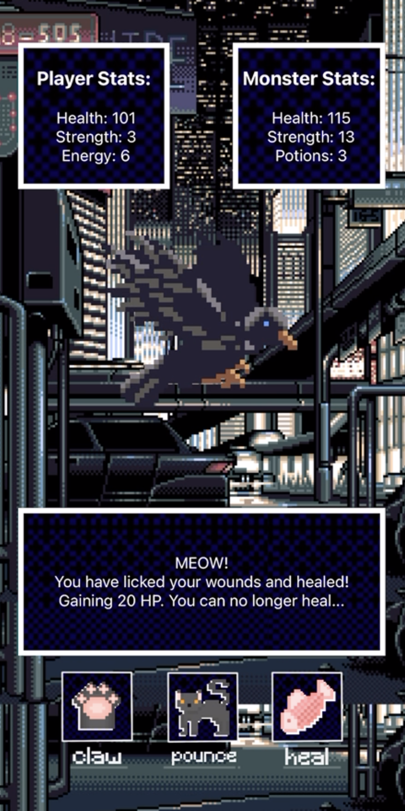

# 🐈 Paws-and-Potions!
Solo Mobile App Project 

- RPG in which the player is a cat that has to fight multiple enemies, including a rat, bunny, and bird. 3 Different Attacks can be used by the player: Claw, Pounce, and Heal. The player can use game points to charge their attacks. 
  
- Tools: React-Native, JavaScript, Procreate, Expo-go, xCode

- How to run it: open the terminal, "npm start", scan the barcode in Expo-go, play!
  
- If you cannot run it, watch the video of the play-through.

# 🐁 Screenshots

    
